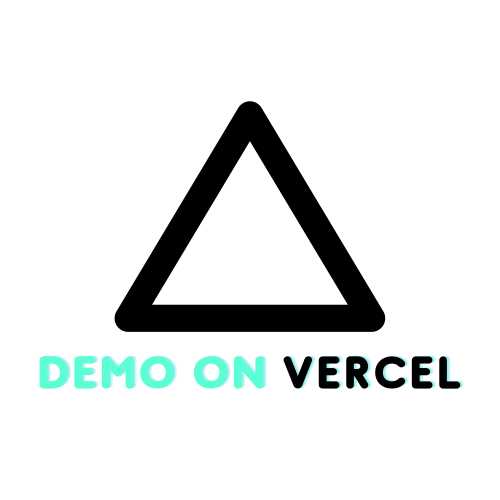
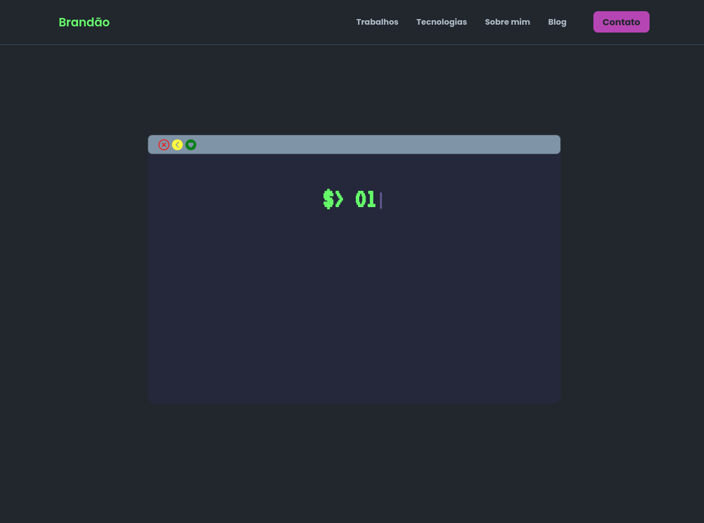

### PROJECT - My Portfolio

### 🐧 Demonstration

<p align="center">
  <a href="https://www.brandaodev.com/" alt="Meu Website">
    
  </a>
</p>

<br>

<p align="center">
  
</p>

### 💻 Description

Welcome to my personal website, where you can find my work through my portfolio, various programming issues and my experience in the market.


## 💂‍♂️ Features

-   [ ] Light & Dark mode
-   [ ] Blog

## 🚀 Technologies

<p align="center">
  
  
</p>

## 🤖 Installation 

1. Clone the repo
   ```sh
   git clone https://github.com/jonbrand/my-portfolio.git
   ```
2. Install YARN packages
   ```sh
   yarn
   ```
3. run the development server
   ```sh
   yarn start
   ```

## 🕹 What I learned

- [x] Custom Hooks
- [x] Dynamic Routes
- [x] Animations
- [x] Scroll trigger effects

## 📑 Licença

Esse projeto está sob a licença MIT. Veja o arquivo [LICENSE](.github/LICENSE.md) para mais detalhes.

## 🔗 Contact

<a href = "https://www.linkedin.com/in/jonatas-brand%C3%A3o/"></a>
---

<p align="center">
  
</p>
